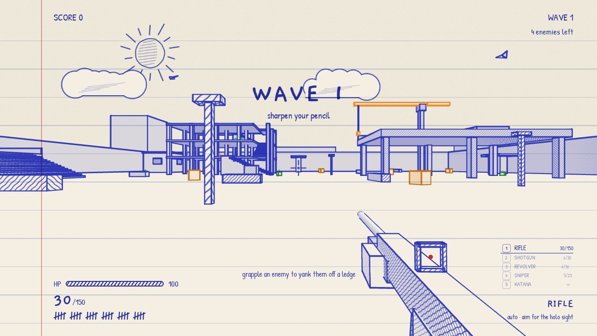
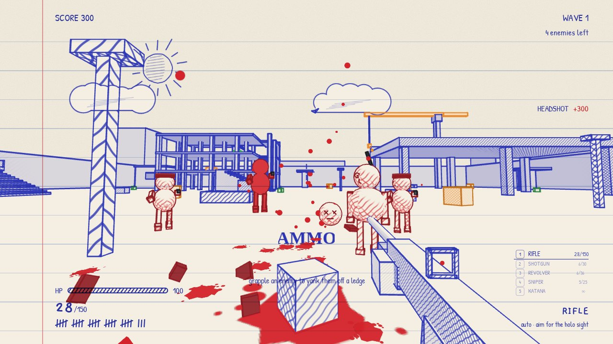
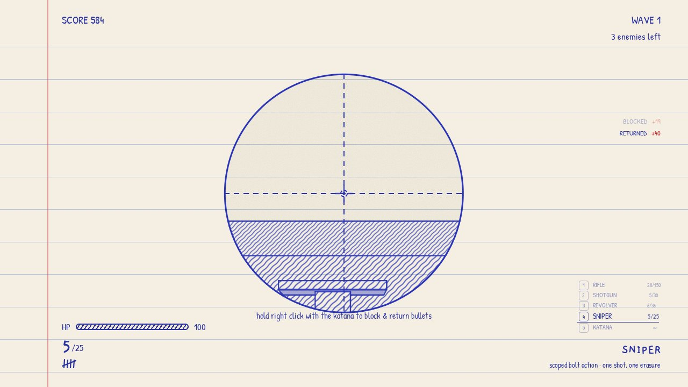
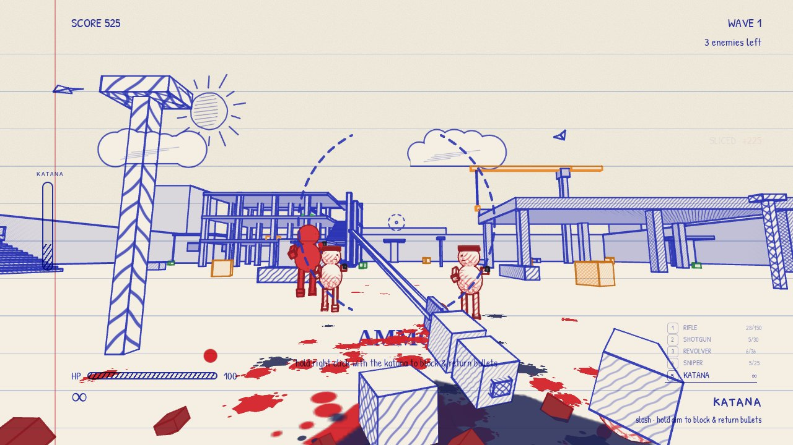
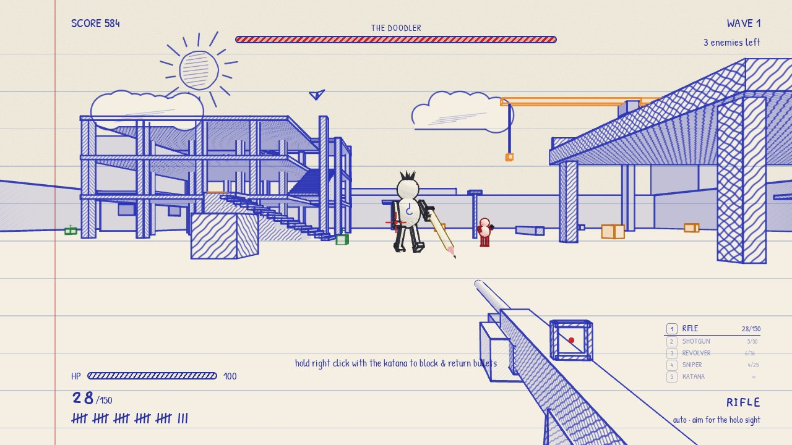
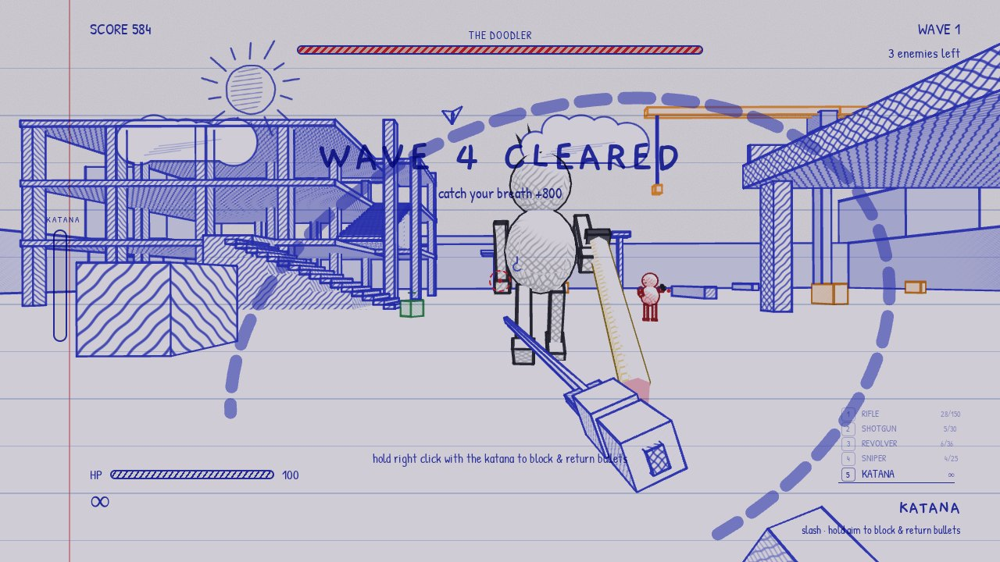
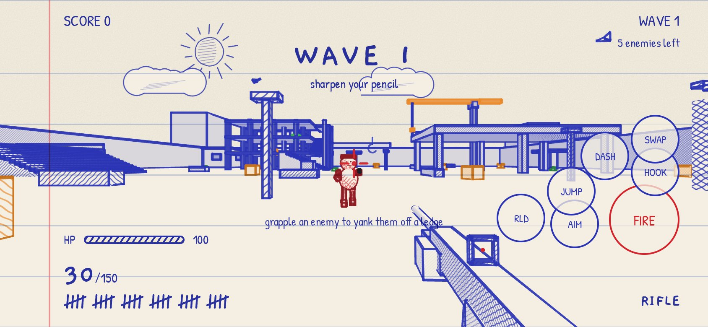

# SCRIBBLE

A first-person wave shooter drawn in blue ballpoint on lined notebook paper. Buildings are cross-hatched boxes, enemies are red stick-figure doodles, blood is red ink, and the HUD is handwriting in the margins. Five weapons, a grapple hook, a katana that parries bullets, and a boss called The Doodler.

Runs in any modern browser from a static folder. No build step.



## Play

Serve the folder and open it, or open `index.html` directly:

```bash
# any static server works
python3 -m http.server 8000
# then http://localhost:8000
```

Opening `index.html` as a `file://` page also works in Chrome and Firefox (the vendored fonts and three.js are plain scripts).

Click to start. The game grabs the mouse; Esc releases it and pauses.

## Controls

| Input | Action |
| --- | --- |
| **WASD** | Move |
| **Mouse** | Look. Left click fires or slashes. Right click aims down the sight, scopes the sniper, or blocks with the katana |
| **Space** | Jump |
| **E** / middle mouse | Grapple. Pulls you to any surface, or yanks an enemy toward you |
| **1-5** / wheel | Rifle, shotgun, revolver, sniper, katana |
| **R** | Reload |
| **Shift** | Dash-execute when the katana meter is full |
| **M** | Mute |
| **P** / Esc | Pause |

Gamepad: left stick moves, right stick looks, RT fires, LT aims, A jumps, X reloads, LB grapples, RB dashes, Y or d-pad swaps weapons.

Touch: left half of the screen is a move stick, right half drags to look, buttons for fire, aim, jump, hook, reload, dash, and swap.

## Weapons

| Slot | Weapon | Ammo | Notes |
| --- | --- | --- | --- |
| 1 | RIFLE | 30/150 | auto · aim for the holo sight |
| 2 | SHOTGUN | 6/30 | pump · devastating up close |
| 3 | REVOLVER | 6/36 | hand cannon · headshots erase |
| 4 | SNIPER | 5/25 | scoped bolt action · one shot, one erasure |
| 5 | KATANA | ∞ | slash · hold aim to block & return bullets |

The katana meter on the left edge fills with kills and parries. When it reads SLASH READY, Shift dashes through enemies for an execution. An airborne execution also refills reserve ammo for every gun.

## Enemies

- **Gunner** keeps its distance and fires bursts.
- **Rusher** sprints at you with a knife.
- **Ink bomb** waddles up and pops. Shoot it before it reaches you, and not while it is next to you.
- **Heavy** is solid red, slow, and takes a full shotgun to drop.
- **Sniper** stands on a ledge with a laser. Grapple it to yank it off.
- **The Doodler** arrives every fifth wave with a giant pencil, a charge, and thrown planks.

Waves add enemy types as they go. Clearing a wave heals you, pays +800, and gives eight seconds before the next one. Kills in quick succession raise the combo multiplier. HP regenerates after a few seconds without damage.

## Screenshots

| | |
| --- | --- |
|  |  |
|  |  |
|  |  |

## How it is drawn

- **Hatching** is a fragment shader. Each face gets one, two, or three families of pen strokes depending on how much it faces a fixed sun, so tops stay paper-white and undersides go dark. Strokes are projected in world space, so they scale with distance and turn into scribble under the sniper scope.
- **Edges** are screen-space fat lines built from `EdgesGeometry`, with a little per-line width jitter. Round parts (heads, barrels, the pencil) get an inverted-hull silhouette instead.
- **Ruled lines and the margin** are a CSS overlay in multiply blend, so they show through the world like the drawing sits on the page.
- **Enemies** are spheres and boxes in red ink with a canvas-drawn face sprite that always turns toward you. Kills scatter chunks, roll a head with X eyes, and stamp blood decals on the nearest surfaces.
- **The level** is a list of axis-aligned boxes merged into one mesh and one line batch. The same boxes drive collision, bullets, the grapple, and a ground-level flow field for enemy pathing.

## Files

```
index.html          page, CSS, HUD markup
js/ink.js           hatch shader, pen lines, hull outlines, canvas art
js/level.js         arena boxes, collision, raycasts, flow field, sky
js/fx.js            decals, droplets, debris, popups, screen feedback, sound
js/enemies.js       enemy rigs, AI, projectiles
js/player.js        movement, weapons, grapple, katana, view models
js/game.js          waves, scoring, HUD, input, main loop
vendor/three.min.js three.js r158 (MIT)
vendor/fonts/       Patrick Hand, Gaegu (SIL OFL)
tools/shoot.js      headless screenshot run (needs playwright)
tools/sim.js        headless autopilot simulation (needs playwright)
```

## Validation

```bash
for f in js/*.js; do node --check "$f"; done
NODE_PATH=$(npm root -g) node tools/shoot.js     # screenshots + console errors
NODE_PATH=$(npm root -g) node tools/sim.js 300   # waves, pathing, NaN checks
```

The simulation steps the game loop directly with a bot that aims, shoots, grapples, and slashes, and reports enemies that stop moving, positions that leave the arena, or console errors.
